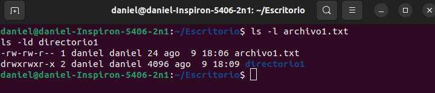
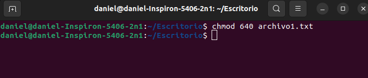
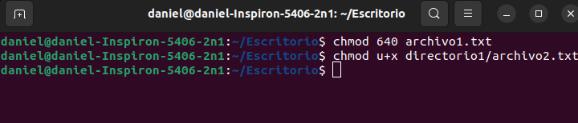
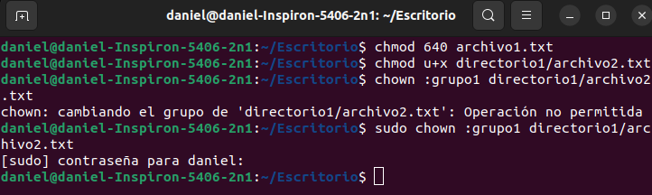
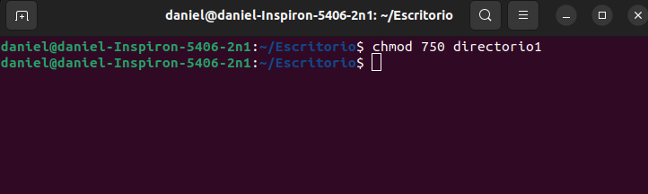
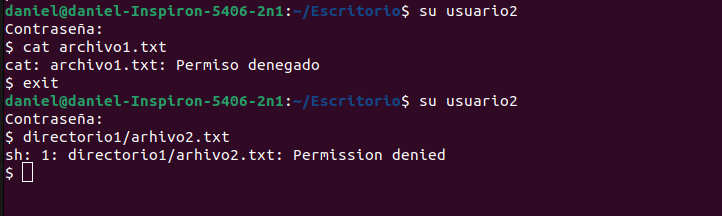
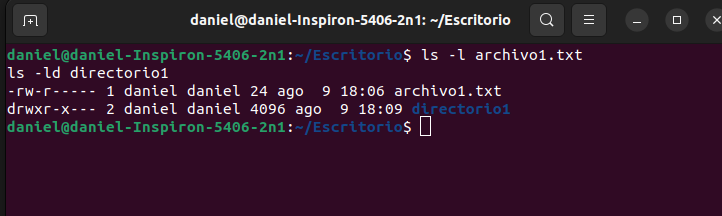

# Parte 1: Gestion de usuarios

## 1. Creacion de usuarios
**Para crear tres usuarios llamados `usuario1`, `usuario2` y `usuario3`, puedes utilizar el siguiente comando en la terminal:**
<br>

**Comando:**
```bash
sudo useradd usuario1
sudo useradd usuario2
sudo useradd usuario3
```
<p align="center">
  
</p>


## 2. Asignación de Contraseñas
**Para establecer nuevas contraseñas para los usuarios creados, utiliza el siguiente comando:**
<br>

**Comando:**
```bash
sudo passwd usuario1
sudo passwd usuario2
sudo passwd usuario3
```
<p align="center">
  
</p>

## 3. Información de Usuarios
**Para mostrar la información del usuario usuario1 utilizando el comando id, ejecuta lo siguiente:**
<br>

**Comando:**
```bash
id usuario1
```
<p align="center">
  
</p>

## 4. Eliminación de Usuarios
**Si deseas eliminar al usuario usuario3 pero conservar su directorio principal, puedes ejecutar el siguiente comando:**
<br>

**Comando:**
```bash
sudo userdel usuario3
```
<p align="center">
  
</p>

<br>

# Parte 2: Gestión de Grupos

## 1. Creación de Grupos
**Para crear dos grupos llamados `grupo1` y `grupo2`, puedes utilizar los siguientes comandos en la terminal:**
<br>

**Comando:**
```bash
sudo groupadd grupo1
sudo groupadd grupo2
```
<p align="center">
  
</p>

## 2. Agregar Usuarios a Grupos
**Para agregar usuario1 a grupo1 y usuario2 a grupo2, utiliza los siguientes**
<br>

**Comando:**
```bash
sudo usermod -aG grupo1 usuario1
sudo usermod -aG grupo2 usuario2
```
<p align="center">
  
</p>

## 3. Verificar Membresía
**Para verificar que los usuarios han sido agregados a los grupos, utiliza el comando groups de la siguiente manera:**
<br>

**Comando:**
```bash
groups usuario1
groups usuario2
```
<p align="center">
  
</p>

## 4. Eliminar Grupo
**Si deseas eliminar grupo2, puedes utilizar el siguiente comando:**
<br>

**Comando:**
```bash
sudo groupdel grupo2
```
<p align="center">
  
</p>

# Parte 3: Gestión de Permisos

## 1. Creación de Archivos y Directorios
**Crea un archivo llamado `archivo1.txt` en su directorio principal y escribe algo en él.**
<br>

**Comando:**
```bash
echo "Contenido del archivo 1" > archivo1.txt
```
<p align="center">
  
</p>
<br>

**Crea un directorio llamado directorio1 y Dentro de directorio1, crea un archivo llamado archivo2.txt.**
<br>

**Comando:**
```bash
mkdir directorio1
touch directorio1/archivo2.txt
```
<p align="center">
  
</p>

## 2. Verificar Permisos
**Para verificar los permisos del archivo y el directorio, utiliza los siguientes comandos:**
<br>

**Comando:**
```bash
ls -l archivo1.txt
ls -ld directorio1
```
<p align="center">
  
</p>

## 3. Modificar Permisos usando chmod con Modo Numérico
**Cambia los permisos del archivo1.txt con el siguiente comando:**
<br>

**Comando:**
```bash
chmod 640 archivo1.txt
```
<p align="center">
  
</p>

## 4. Modificar Permisos usando chmod con Modo Simbólico
**Agrega permiso de ejecución al propietario del archivo2.txt con el siguiente comando:**
<br>

**Comando:**
```bash
chmod u+x directorio1/archivo2.txt
```
<p align="center">
  
</p>

## 5. Cambiar el Grupo Propietario
**Cambia el grupo propietario de archivo2.txt a grupo1 con el siguiente comando:**
<br>

**Comando:**
```bash
chown :grupo1 directorio1/archivo2.txt
```
<p align="center">
  
</p>

## 6. Configurar Permisos de Directorio
**Cambia los permisos del directorio1 con el siguiente comando:**
<br>

**Comando:**
```bash
chmod 750 directorio1
```
<p align="center">
  
</p>

## 7. Comprobación de Acceso
**Intenta acceder a archivo1.txt y directorio1/archivo2.txt como usuario2 y nota cómo el permiso de directorio afecta el acceso a los archivos dentro de él.**
<br>

**Comando:**
```bash
su usuario2   # Cambiar al usuario2
cat archivo1.txt   # Intentar leer el archivo
exit   # Salir del usuario2
su usuario2   # Cambiar al usuario2
cat directorio1/archivo2.txt   # Intentar leer el archivo
exit   # Salir del usuario2
```

<p align="center">
  
</p>

## 8. Verificación Final
**Verifica los permisos y el propietario de los archivos y el directorio nuevamente con los siguientes comandos:**
<br>

**Comando:**
```bash
ls -l archivo1.txt
ls -ld directorio1
```
<p align="center">
  
</p>

# REFLEXION

## Importancia de la Gestión de Usuarios y Permisos en un Sistema Operativo

La gestión adecuada de usuarios y permisos en un sistema operativo es esencial por diversas razones:

- **Seguridad:** La correcta asignación de permisos protege los datos y recursos del sistema, evitando accesos no autorizados y posibles ataques.

- **Privacidad:** La gestión de usuarios garantiza la confidencialidad de la información personal y los archivos, limitando el acceso solo a usuarios autorizados.

- **Control de Acceso:** Permite administrar quiénes pueden realizar acciones específicas en el sistema, evitando modificaciones o eliminaciones no deseadas.

- **Prevención de Errores:** Una gestión apropiada minimiza riesgos, como cambios accidentales en archivos críticos que puedan afectar el funcionamiento del sistema.

- **Auditoría y Cumplimiento:** Facilita la trazabilidad de acciones realizadas, crucial para auditorías y para cumplir con regulaciones y políticas de seguridad.

## Comandos y Técnicas para Gestionar Permisos en Linux

Además de los comandos previamente mencionados, hay otras herramientas y técnicas útiles:

- `chgrp`: Cambia el grupo propietario de archivos y directorios.
- `chmod`: Modifica permisos con notación octal o simbólica.
- `umask`: Define permisos por defecto para nuevos archivos y directorios.
- `chown`: Cambia propietario y/o grupo de archivos y directorios.
- `sudo`: Permite ejecutar comandos con privilegios de superusuario.
- `setfacl`: Configura listas de control de acceso (ACL) para permisos avanzados.
- `getfacl`: Muestra permisos de control de acceso (ACL) de archivos y directorios.

Herramientas de administración de usuarios y grupos como `useradd`, `userdel`, `groupadd`, `groupdel` también simplifican la gestión.

En resumen, la gestión de usuarios y permisos de manera efectiva en Linux es esencial para salvaguardar la seguridad, privacidad y funcionamiento del sistema, además de asegurar el cumplimiento normativo.

