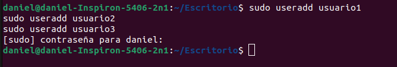
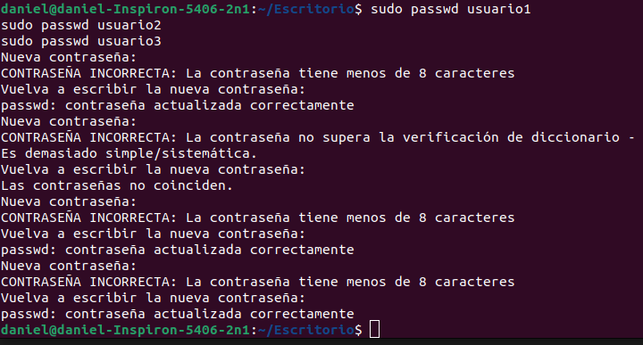
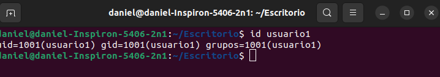
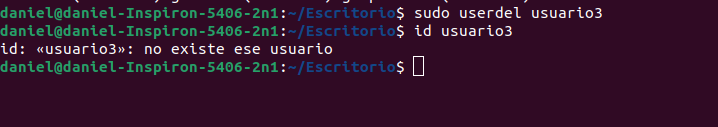
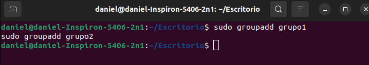
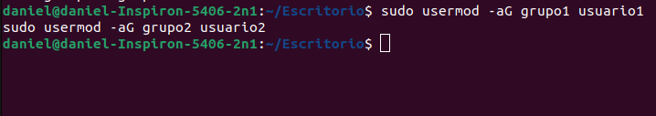
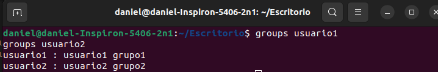
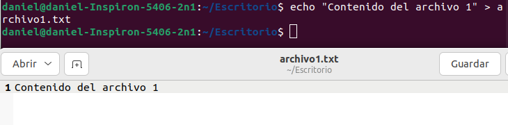
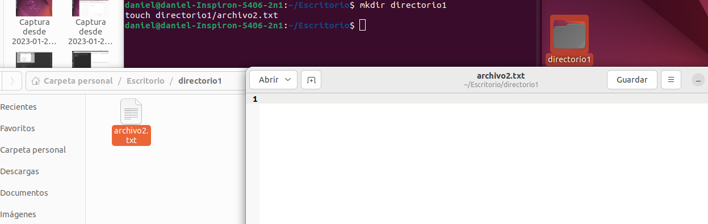

# Parte 1: Gestion de usuarios

## 1. Creacion de usuarios
**Para crear tres usuarios llamados `usuario1`, `usuario2` y `usuario3`, puedes utilizar el siguiente comando en la terminal:**
<br>

**Comando:**
```bash
sudo useradd usuario1
sudo useradd usuario2
sudo useradd usuario3
```
<p align="center">
  
</p>


## 2. Asignación de Contraseñas
**Para establecer nuevas contraseñas para los usuarios creados, utiliza el siguiente comando:**
<br>

**Comando:**
```bash
sudo passwd usuario1
sudo passwd usuario2
sudo passwd usuario3
```
<p align="center">
  
</p>

## 3. Información de Usuarios
**Para mostrar la información del usuario usuario1 utilizando el comando id, ejecuta lo siguiente:**
<br>

**Comando:**
```bash
id usuario1
```
<p align="center">
  
</p>

## 4. Eliminación de Usuarios
**Si deseas eliminar al usuario usuario3 pero conservar su directorio principal, puedes ejecutar el siguiente comando:**
<br>

**Comando:**
```bash
sudo userdel usuario3
```
<p align="center">
  
</p>

<br>

# Parte 2: Gestión de Grupos

## 1. Creación de Grupos
**Para crear dos grupos llamados `grupo1` y `grupo2`, puedes utilizar los siguientes comandos en la terminal:**
<br>

**Comando:**
```bash
sudo groupadd grupo1
sudo groupadd grupo2
```
<p align="center">
  
</p>

## 2. Agregar Usuarios a Grupos
**Para agregar usuario1 a grupo1 y usuario2 a grupo2, utiliza los siguientes**
<br>

**Comando:**
```bash
sudo usermod -aG grupo1 usuario1
sudo usermod -aG grupo2 usuario2
```
<p align="center">
  
</p>

## 3. Verificar Membresía
**Para verificar que los usuarios han sido agregados a los grupos, utiliza el comando groups de la siguiente manera:**
<br>

**Comando:**
```bash
groups usuario1
groups usuario2
```
<p align="center">
  
</p>

## 4. Eliminar Grupo
**Si deseas eliminar grupo2, puedes utilizar el siguiente comando:**
<br>

**Comando:**
```bash
sudo groupdel grupo2
```
<p align="center">
  
</p>

# Parte 3: Gestión de Permisos

## 1. Creación de Archivos y Directorios
**Crea un archivo llamado `archivo1.txt` en su directorio principal y escribe algo en él.**
<br>

**Comando:**
```bash
echo "Contenido del archivo 1" > archivo1.txt
```
<p align="center">
  
</p>
<br>

**Crea un directorio llamado directorio1 y Dentro de directorio1, crea un archivo llamado archivo2.txt.**
<br>

**Comando:**
```bash
mkdir directorio1
touch directorio1/archivo2.txt
```
<p align="center">
  
</p>


